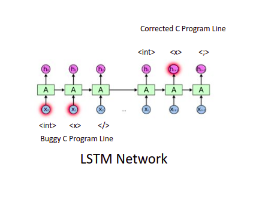
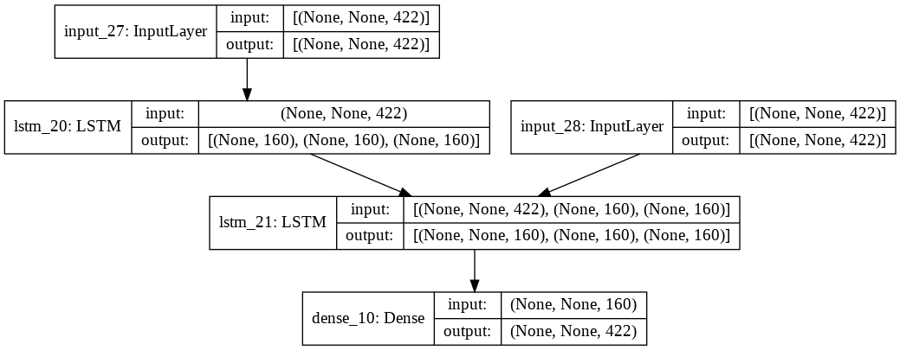

<h3 align="center">DeepFix-Lite</h3>

Deep learning for automatically fixing single-line syntax errors in C programs

------------------------------------------
Designed, implemented and evaluated a deep learning based solution to fix syntactic errors in C programs. The programs were written by students in
introductory programming assignments and contain single-line errors.

------------------------------------------
### Problem Statement :
We were provided two CSV files `train.csv` and `valid.csv` which respectively contain training and validation data. Each row in these CSV files contains the following fields/columns:

a) `Unnamed: 0` = the row number

b) `sourceText` = the buggy C program

c) `targetText` = the fixed C program

d) `sourceLineText` = code on the buggy line in sourceText

e) `targetLineText` = code on the fixed line in targetText

f) `lineNums_Text` = line number (starting from 1) of the buggy line in sourceText

g) `sourceTokens` = a list of token-lists where each token-list gives the tokens
corresponding to the respective line of code in sourceText

h) `targetTokens` = a list of token-lists where each token-list gives the tokens
corresponding to the respective line of code in targetText

i) `sourceLineTokens` = a list of tokens corresponding to sourceLineText

j) `targetLineTokens` = a list of tokens corresponding to targetLineText

I had to train a `sequence-to-sequence` neural network to
map `sourceLineTokens` to `targetLineTokens`, that is, from the token sequence of only the buggy line in the input program (sourceLineText) to the corresponding
fixed line (targetLineText).

------------------------------------------
### Solution: 
- A neural network cannot be directly fed in with code (or in general, text). Hence I
tokenized the code using `tokenization.py` . 
- Converted a token sequence into a sequence of indices into a vocabulary. For
this, I built a vocabulary by first iterating over training data and
collecting all unique tokens.
- Used some special tokens to indicate the end of an input sequence and the
start of an output sequence and then fixed the lengths of input and output
sequences when you are building the neural network. Longer sentences should be
truncated and shorted ones should be padded. It is therefore essential to create special
tokens to indicate these cases and reserve indices for them carefully.
- Each token (index) will be mapped to a vector commonly called an
embedding in neural network. With limited training data, learning good token
embeddings for all the tokens may not be feasible. It is therefore common to restrict the
vocabulary to top-k most frequent tokens for some value of k that one can decide
through experimentation (e.g., 250, 500, 1000, etc.). The rest of the tokens are
mapped to an out-of-vocabulary token.
- To better obtain better reprentation of input instead of using the
original variable names, I mapped them to some predefined space of variable names. For
example, all integer variables could be mapped to `VAR_INT_1, VAR_INT_2`, etc. In fact,
we can simplify this further and ignore the type and just rename variables to `VAR_1,
VAR_2, etc`. The advantage is that now vocabulary
now is much smaller and fixed. It will include any language-specific tokens (e.g.,
opening and closing braces or parentheses, types such as int, char, etc.) plus the fixed
number of normalized variable names. In comparison, without normalization, our
vocabulary will have real variable names seen in the training data (e.g., x, my_function,
etc.). Normalized variable names will reduce `OOV` (Out of vocabulory) cases (which usually impact the
model accuracy) and would result in smaller vocabularies.
- During training,neural network should take (x, y) pairs as examples, where x is the
token sequence for buggy program-line.
- The sequence y is the expected output sequence,
that is, the tokenized version of the fixed line. I mapped the tokens to their
indices using the vocabulary.
- It is common to use `teacher-forcing` to train a sequence-to-sequence model hence I used it.
- Used  `LSTM`- recurrent neural architecture for this seq2seq problem statement. 
  
- Here is visual representation of LSTM model :

  

- For evaluating model I have written `demo_eval.py` script which should be invoked as follows
`python demo-eval.py <input-csv-file> <output-csv-file>`
- The script loads the model and then iterate over each token sequence from the `input-csv-file` (either,
`sourceTokens` or `sourceLineTokens` depending on the problem you are solving) and runs
the model in the evaluation mode (not the training mode) to obtain the predicted output
sequence. 
- The predicted sequence of vocabulary indices is be mapped back to the
tokens. An output file `output-csv-file` is
generated that includes the inputs from the `input-csv-file` and a new column `fixedTokens`
corresponding to my model prediction.

- Here is model-summary of LSTM network:
  

  

### Model Performance : 
- 91% token-level accuracy is achieved i.e 91% tokens are mathed from the output produced by network.
- 33% of programs is correctly being fixed among all the programs. 

### Future Work :
- One can try `attention-transformers` based RNN architectures for this problem.
- Better tokenization mechansism for C code.
- Better representations / Embeddings for code.
- Better initialisations / biases for network.  

------------------------------------------
### Acknoledgements :

- Major ideas of this work are derived from [DeepFix](http://www.iisc-seal.net/deepfix).
   
